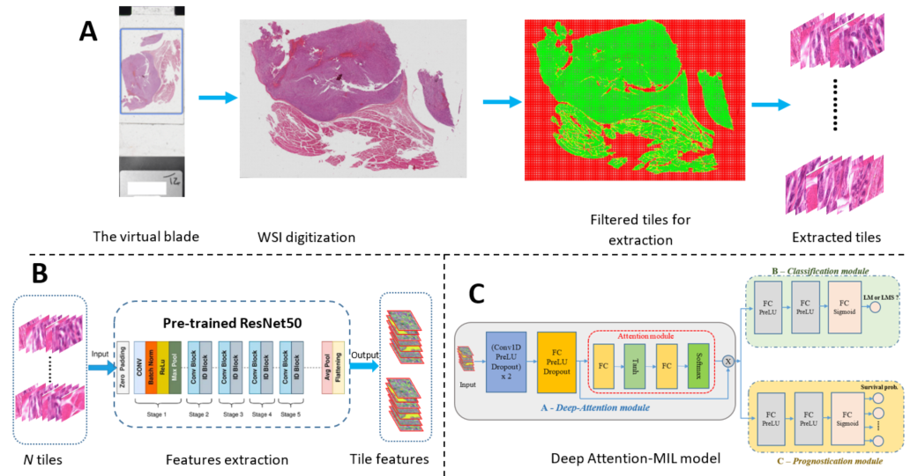
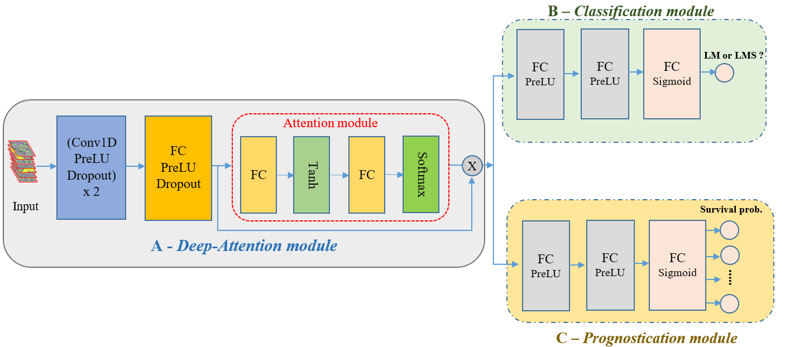

# Deep learning for classification and prognostication of Gynaecologic Smooth Muscle Tumors 

This repository contains the source code of Deep-Attention Multiple Instance Learning (Deep-Attention MIL) models
for classification and prognostication of Gynaecologic Smooth Muscle Tumors (Uterus cancer).

## Overview of the framework to work with Whole Slide Images (WSIs) and proposed system
To work with WSIs, a framework consisting of three phases has been used: (1) getting tiles (patches) from the WSIs of patients; (2) extracting the features from the extracted tiles by using an encoder, i.e., pre-trained <a href="https://arxiv.org/abs/1512.03385" target="blank">ResNet50</a>; (3) deep learning model to perform the goals of the study. 

The proposed system in this study was stayed at the third phase of the <a href = "https://inria.hal.science/hal-04235077/document" target = "blank">framework </a> to classify and predict the survival of uterine cancer patients.

## Installation:
<ul>
	<li>CentOS Linux 7 (Linux 3.10.0-957.el7.x86_64)</li>
	<li>NVIDIA GPU (Quadro RTX 8000)</li>
	<li>Python (3.9.5), numpy (1.21.2), torch (2.2.1+cu121), torchvision (0.12.0), pytorch-lightning (1.5.9)</li>
</ul>

## The source code:
1. Classification task: GSMT_src_classification folder.
	<ul>
		<li><i>main_cv.py</i>: The main file to run the cross-validation test for classification task</li>
		<li><i>model_pl.py</i>: The classification model</li>
		<li><i>bergonie_dataloader_survival_wsi.py</i>: The file to load and create the Dataset, Dataloader</li>
		<li><i>inference_CV.py</i>: The inference process for cross-validation</li>
	</ul>

2. Prognostication task: GSMT_src_survival folder.
	<ul>
		<li><i>main_clinical_cv.py</i>: The main file to run the cross-validation test for prognostication task</li>
		<li><i>model_pl.py</i>: The prognostication model</li>
		<li><i>bergonie_dataloader_survival_wsi_clinical.py</i>: The file to load and create the Dataset, Dataloader</li>
		<li><i>inference_clinical_CV.py</i>: The inference process for cross-validation</li>
	</ul>